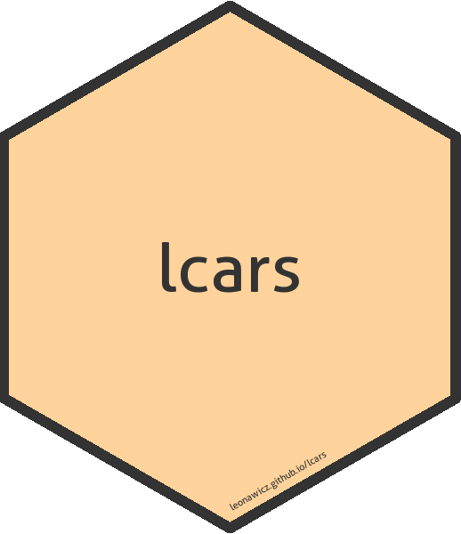

<!-- README.md is generated from README.Rmd. Please edit that file -->

# lcars 

**Author:** [Matthew Leonawicz](https://github.com/leonawicz)
<a href="https://orcid.org/0000-0001-9452-2771" target="orcid.widget">
<image class="orcid" src="https://members.orcid.org/sites/default/files/vector_iD_icon.svg" height="16"></a>
<br/> **License:** [MIT](https://opensource.org/licenses/MIT)<br/>

[](https://www.repostatus.org/)
[](https://travis-ci.org/leonawicz/lcars)
[](https://ci.appveyor.com/project/leonawicz/lcars)
[](https://codecov.io/gh/leonawicz/lcars?branch=master)

[](https://cran.r-project.org/package=lcars)
[](https://cran.r-project.org/package=lcars)
[](https://github.com/leonawicz/lcars)

## Library Computer Access/Retrieval System ([LCARS](https://en.wikipedia.org/wiki/LCARS))

The `lcars` package provides Shiny widgets and Shiny UI theme that
support an LCARS aesthetic for Shiny apps.

Using an LCARS aesthetic to visually frame the results of your analysis
is fun and quirky in its own right, but it begs the next obvious step:
interactivity. LCARS-themed displays can be fun to make, but using Shiny
is much more exciting because you can make something with the look and
feel of LCARS that also is *actually operational* and not just another
piece of static digital fan art\!


That’s right. Make your Shiny app, view it on a touch screen device like
your very own Federation-issue data PADD, and transport yourself into
the future of the Star Trek universe with this 1980s sci-fi television
aesthetic\!

### Function names

The package also offers `lcars_border` and associated functions for
adding a minimal LCARS theme to static ggplot2 graphs, but this is less
interesting given the context and won’t look as authentic and the Shiny
counterparts.

On the topic of the split between Shiny and non-Shiny functions, most of
the package is Shiny-related. There is less focus on the ggplot border
effect and related border component functions. Shiny functions use camel
case like `lcarsBox` whereas non-Shiny functions use snake case like
`lcars_border`. Most users will probably only use the Shiny functions.

### Shiny functions

There are several Shiny functions available. These are UI containers and
widgets that provide various LCARS aesthetics.

UI setup and containers:

  - `lcarsPage`
  - `lcarsBox`
  - `lcarsSweep`
  - `lcarsBracket`
  - `lcarsWell`
  - `inputColumn`

Headers and indicators:

  - `lcarsHeader`, `lcarsh1` through `lcarsh6`.
  - `lcarsRect`, `lcarsPill`, etc.

Input controls

  - `lcarsButton`
  - `lcarsCheckbox`
  - `lcarsToggle`
  - `lcarsRadio`
  - `lcarsRadioToggle`

The key widgets are `lcarsHeader`, `lcarsBox` and `lcarsSweep`. An
example of the header and box is shown above. Here is a combined LCARS
sweep and reverse sweep:


The screenshots above are taken directly from demo apps included in the
package. See `?lcarsApp` for details. For detailed examples including
Shiny app examples, see the package
[vignette](https://leonawicz.github.io/lcars/articles/lcars.html).

## Installation

Install the CRAN release of `lcars` with

``` r
install.packages("lcars")
```

Install the development version from GitHub with

``` r
# install.packages("remotes")
remotes::install_github("leonawicz/lcars")
```

## Limitations

In adhering closely to sizing and layout rules for LCARS UI design,
fixed sizing works best for some container widgets like `lcarBox` and
`lcarsSweep`. You can use settings like `width = "100%"` for these
containers, but you may notice limitations in maintaining a responsive
UI, particularly when they contain plot outputs. Fixed width widgets are
generally recommended.

Visual components such as the LCARS elbow shape underlying some widgets
are intended to follow strict sizing and scaling rules. They are not
intended to scale arbitrarily or fit well on very small device screens.

## Packages in the trekverse

<div class="row">

<div class="col-sm-2">

<a href="https://github.com/leonawicz/rtrek"></a>

</div>

<div class="col-sm-10">

<h4 style="padding:30px 0 0 0;margin-top:5px;margin-bottom:5px;">

<a href="https://github.com/leonawicz/rtrek">rtrek</a>: The core Star
Trek package

</h4>

Datasets related to Star Trek, API wrappers to external data sources,
and more.

</div>

</div>

<br/>

<div class="row">

<div class="col-sm-2">

<a href="https://github.com/leonawicz/lcars"></a>

</div>

<div class="col-sm-10">

<h4 style="padding:30px 0 0 0;margin-top:5px;margin-bottom:5px;">

<a href="https://github.com/leonawicz/lcars">lcars</a>: LCARS aesthetic
for Shiny

</h4>

Create Shiny apps based on the Library Computer Access/Retrieval System
(LCARS).

</div>

</div>

<br/>

<div class="row">

<div class="col-sm-2">

<a href="https://github.com/leonawicz/trekcolors"></a>

</div>

<div class="col-sm-10">

<h4 style="padding:30px 0 0 0;margin-top:5px;margin-bottom:5px;">

<a href="https://github.com/leonawicz/trekcolors">trekcolors</a>: A
color palette package

</h4>

Predefined and customizable Star Trek themed color palettes and related
functions.

</div>

</div>

<br/>

<div class="row">

<div class="col-sm-2">

<a href="https://github.com/leonawicz/trekfont"></a>

</div>

<div class="col-sm-10">

<h4 style="padding:30px 0 0 0;margin-top:5px;margin-bottom:5px;">

<a href="https://github.com/leonawicz/trekfont">trekfont</a>: A fonts
package

</h4>

True (Trek) type fonts to style your Star Trek themed graphics text.

</div>

</div>

<br>

## Citation

Matthew Leonawicz (2020). lcars: LCARS Aesthetic for Shiny. R package
version 0.3.6. <https://github.com/leonawicz/lcars>

## Contribute

Contributions are welcome. Contribute through GitHub via pull request.
Please create an issue first if it is regarding any substantive feature
add or change.

If you enjoy my open source R community contributions, please consider a
donation :).

  - [Buy me a coffee in Ko-fi](https://ko-fi.com/leonawicz)
  - `leonawicz.crypto`
  - `mfl$payid.crypto.com`

-----

Please note that the `lcars` project is released with a [Contributor
Code of
Conduct](https://github.com/leonawicz/lcars/blob/master/CODE_OF_CONDUCT.md).
By contributing to this project, you agree to abide by its terms.
